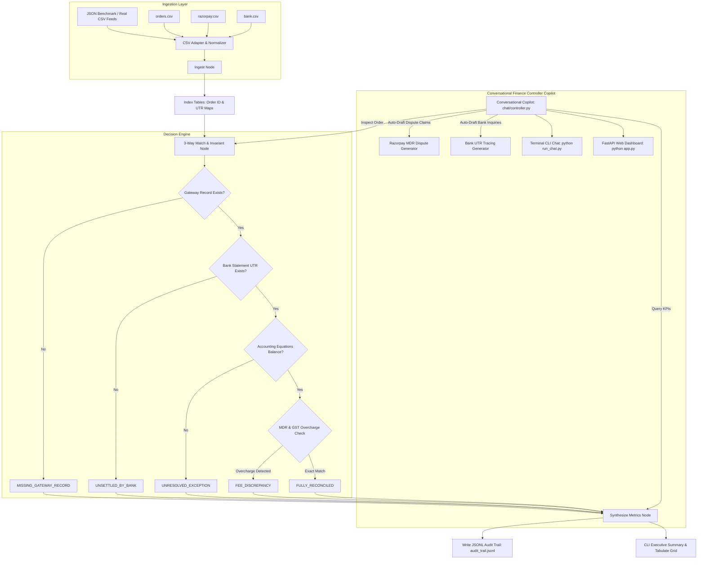

# AI Finance Controller: 3-Way Reconciliation Engine & Copilot Chat
**Razorpay Buildathon — Track 04: Agentic Financial Workflows**

A production-grade, deterministic, and evaluable **3-Way Reconciliation Agent & Conversational Finance Controller Copilot** built with LangGraph, Pydantic, FastAPI, and strict Decimal accounting invariants.

---

## 📌 Problem Statement
In modern fintech and high-volume e-commerce architectures, settlement reconciliation across disparate sources is prone to silent financial leakage:
1. **Internal Order Management Systems (OMS)**: Record customer purchases, orders marked `PAID`, and tax invoices.
2. **Payment Gateway Dumps (Razorpay)**: Record transaction charges, Merchant Discount Rates (MDR), GST on fees, and bank payout UTRs.
3. **Bank Account Statements**: Record actual cleared net credit entries mapped by UTR.

Discrepancies such as gateway fee overcharging (e.g. 3% MDR instead of contracted 2%), delayed/unsettled bank credits, and phantom orders (paid in OMS but missing in gateway dumps) lead to loss of revenue and tedious manual auditing.

---

## 🏗️ Architecture & State Machine



---

## ⚖️ Deterministic vs. LLM Boundary

| Domain Dimension | Deterministic Engine (Rules & Models) | Agentic & Conversational Layer (Copilot & Dispute Generator) |
| :--- | :--- | :--- |
| **Financial Arithmetic** | Python `Decimal` with `ROUND_HALF_UP` (zero float drift). | Translates financial insights into human-readable business narratives. |
| **Accounting Invariants** | Strict equation checks: `Gross - (MDR + GST) == Net == Bank Credit`. | Routes anomalies to auto-remediation and dispute channels. |
| **MDR Fee Audit** | Contracted rate comparisons (2% + 18% GST vs. actual deducted). | Formats itemized schedules and calculates exact recoverable claims. |
| **Audit Logging** | Atomic write of structured JSON Lines to `audit_trail.jsonl`. | Answers multi-turn questions about audit steps and order histories. |

---

## 📊 Core Data Models

- **`InternalOrder`**: `order_id`, `amount: Decimal`, `tax_amount: Decimal`, `customer_id`, `status`, `created_at`
- **`RazorpaySettlement`**: `payment_id`, `order_id`, `gross_amount: Decimal`, `fee: Decimal`, `tax_on_fee: Decimal`, `net_amount: Decimal`, `utr: Optional[str]`, `settled_at`
- **`BankStatementEntry`**: `bank_ref`, `utr: str`, `credit_amount: Decimal`, `value_date`, `description`
- **`AuditLogEntry`**: `timestamp: ISO-8601`, `order_id`, `step`, `action_taken`, `math_verified: bool`, `details: dict`
- **`ReconciliationResult`**: Complete reconciliation record including root cause and dispute actions.

---

## 📈 Evaluation & Benchmark Metrics

Across our standardized 60-record benchmark batch:
- **Total Transactions**: 60
- **Match Rate (Clean 3-Way)**: 66.67% (40 orders)
- **Exception Rate**: 33.33% (20 orders)
  - **MDR Overcharges (3% instead of 2%)**: 8 orders (Auto-flagged with exact recoverable delta of **INR 1,300.92**)
  - **Unsettled in Bank (UTR missing in bank)**: 6 orders (Flagged with amount at risk)
  - **Missing Gateway Records (Ghost orders)**: 6 orders (Flagged for payment ops)
- **Precision / Math Invariant Verification**: 100.0% (Zero rounding errors)

---

## 🚀 Quickstart Guide

### 1. Install Dependencies
```bash
pip install -r requirements.txt
```

### 2. Run Reconciliation with Real CSV Files
```bash
# Export sample CSV files for testing:
python run_reconciliation.py --export-samples

# Run reconciliation on CSV feeds:
python run_reconciliation.py --orders data/samples/sample_orders.csv --settlements data/samples/sample_razorpay.csv --bank data/samples/sample_bank.csv
```

### 3. Run Pytest Suite (19 Tests)
```bash
pytest -v
```

### 4. Run Executive Reconciliation Pipeline & Terminal Report
```bash
python run_reconciliation.py
```

### 5. Launch Interactive Terminal Copilot Chat
```bash
python run_chat.py
```

### 6. Launch Modern Web Dashboard & Chat UI
```bash
python app.py
```
Open **`http://127.0.0.1:8000`** in your browser to access:
- 💬 Real-Time AI Finance Controller Chat with suggested prompt pills
- 📊 Live KPI Stat Cards (Match Rate, Total Volume, Amount at Risk, Recoverable MDR)
- 📁 **Real CSV Ingestion Tab**: Upload custom CSV feeds or generate sample CSVs with 1 click
- ⚠️ Filterable Discrepancies Table with one-click order deep-dive
- 📝 Auto-generated Razorpay MDR Dispute Letter with 1-click Copy to Clipboard
- 📜 Live JSONL Audit Trail streaming

---

## 📁 Repository Structure
```text
RAZORPAY/
├── core/
│   ├── __init__.py
│   ├── models.py                  # Strict Decimal Pydantic domain models
│   └── rules.py                   # Accounting invariants & MDR calculation engine
├── agent/
│   ├── __init__.py
│   ├── state.py                   # LangGraph TypedDict state with operator.add
│   ├── nodes.py                   # Ingest, 3-way match, fee audit, and metrics nodes
│   └── graph.py                   # StateGraph compiler
├── audit/
│   ├── __init__.py
│   └── logger.py                  # Structured JSONL atomic audit trail logger
├── chat/
│   ├── __init__.py
│   ├── controller.py              # Conversational Financial Controller agent
│   ├── cli.py                     # Rich terminal interactive chat
│   └── server.py                  # FastAPI server & Single-Page Dashboard
├── data/
│   ├── __init__.py
│   ├── csv_adapter.py             # Flexible CSV reader, normalizer, & sample exporter
│   ├── generate_batch.py          # 60-record realistic batch generator
│   ├── dataset_batch_60.json      # Benchmark dataset
│   └── samples/                   # Exported sample CSV files
├── tests/
│   ├── __init__.py
│   ├── test_csv_adapter.py        # CSV ingestion & normalization tests
│   ├── test_reconciliation.py     # Reconciliation unit & integration tests
│   └── test_chat_controller.py   # Chat intent & API endpoint tests
├── app.py                         # Root Web Application runner
├── run_chat.py                    # Root Terminal Chat runner
├── run_reconciliation.py          # Interactive CLI with Rich & Tabulate tables
├── requirements.txt               # Dependencies
└── README.md                      # Architecture documentation
```
